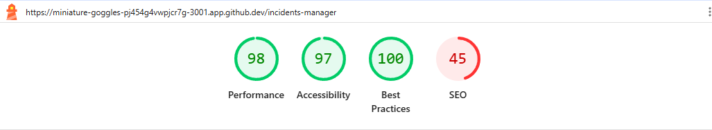
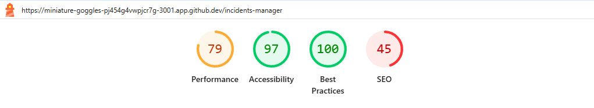
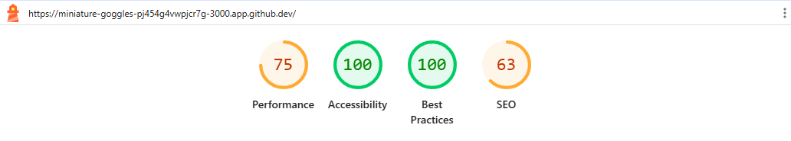

# Auditoría de Rendimiento Frontend — TrackFlow

> **Fecha:** 2026-09-07
> **Alcance:** Backoffice (Dashboard, Inventario, Gestor de Incidencias) y Web Corporativa
> **Dispositivos:** Desktop y Mobile
> **Herramienta:** Google Lighthouse
> **Propósito:** Evaluar el rendimiento, la accesibilidad, las buenas prácticas y el SEO de las interfaces de usuario de TrackFlow, identificando oportunidades de mejora y documentando los hallazgos para su corrección.

---

## Índice

1. [Resumen Ejecutivo](#1-resumen-ejecutivo)
2. [Metodología](#2-metodología)
3. [Backoffice — Desktop](#3-backoffice--desktop)
   - 3.1 [Dashboard](#31-dashboard)
   - 3.2 [Inventario](#32-inventario)
   - 3.3 [Gestor de Incidencias](#33-gestor-de-incidencias)
4. [Backoffice — Mobile](#4-backoffice--mobile)
   - 4.1 [Dashboard](#41-dashboard)
   - 4.2 [Inventario](#42-inventario)
   - 4.3 [Gestor de Incidencias](#43-gestor-de-incidencias)
5. [Web Corporativa](#5-web-corporativa)
   - 5.1 [Desktop](#51-desktop)
   - 5.2 [Mobile](#52-mobile)
6. [Conclusiones y Recomendaciones Generales](#6-conclusiones-y-recomendaciones-generales)
7. [Análisis de Refactorización — Duplicación en el Codebase](#7-análisis-de-refactorización--duplicación-en-el-codebase)
   - 7.1 [Sistema i18n duplicado](#71-sistema-de-internacionalización-i18n-duplicado)
   - 7.2 [Footer duplicado](#72-componente-footer-duplicado)
   - 7.3 [LanguageSwitcher duplicado](#73-selector-de-idioma-languageswitcher-duplicado)

---

## 1. Resumen Ejecutivo

Se ha realizado una auditoría de rendimiento frontend sobre las principales interfaces de TrackFlow utilizando **Google Lighthouse**. El análisis abarca tres aplicaciones del **Backoffice** (Dashboard, Inventario y Gestor de Incidencias) en sus versiones **Desktop** y **Mobile**, así como la **Web Corporativa** también en ambos formatos.

Los resultados revelan problemas transversales que afectan a todas las páginas analizadas:

| Dimensión | Estado general |
|-----------|---------------|
| **Rendimiento** | Afectado por JavaScript y CSS no optimizados, imágenes sin comprimir y resources que bloquean el renderizado |
| **Accesibilidad** | Carencia de elementos `<title>`, etiquetas `<label>` en formularios y problemas de contraste de color |
| **Buenas Prácticas** | Carencia de políticas CSP robustas, falta de HSTS y source maps ausentes |
| **SEO** | Páginas bloqueadas para indexación, ausencia de `<title>` y meta description en la mayoría de páginas |

> **Nota:** Las imágenes de los resultados de Lighthouse están disponibles en la carpeta `audit/before/`.

---

## 2. Metodología

La auditoría se ha realizado siguiendo estos pasos:

1. **Ejecución de Google Lighthouse** en cada página objetivo, tanto en escritorio como en móvil.
2. **Captura de pantalla** de los resultados generales de cada auditoría.
3. **Extracción y categorización** de los hallazgos en cuatro dimensiones: Performance, Accesibilidad, Buenas Prácticas y SEO.
4. **Análisis de cada hallazgo**, identificando el impacto y proponiendo soluciones concretas.
5. **Documentación** estructurada en este informe.

---

## 3. Backoffice — Desktop

### 3.1 Dashboard


#### 3.1.1 Performance

##### Insights

El análisis de rendimiento revela varias áreas de mejora significativas:

- **Árbol de dependencias de red:** Se detectan dependencias complejas entre recursos que alargan la cadena de carga.
- **Mejora en la entrega de imágenes:** Se estima un ahorro potencial de **5 KiB** optimizando el formato y compresión de imágenes.
- **Recursos que bloquean el renderizado:** Hay ficheros CSS/JS cuyo procesamiento retrasa la pintura del primer contenido visible.
- **JavaScript heredado:** Se estima un ahorro de **9 KiB** eliminando código JS obsoleto o no utilizado.
- **Culpables de desplazamiento de diseño (Layout Shift):** Existen elementos sin dimensiones explícitas que provocan saltos visuales durante la carga.
- **Desglose de LCP:** El Largest Contentful Paint se ve afectado por los puntos anteriores.

> **Solución:** Identificar y eliminar dependencias redundantes, aplicar técnicas de *code splitting* y *tree shaking*, usar formatos de imagen modernos (WebP/AVIF) con `loading="lazy"`, y precargar los recursos críticos.

##### Diagnostics

| Diagnóstico | Ahorro estimado |
|-------------|----------------|
| Minificar JavaScript | 215 KiB |
| Reducir JavaScript no utilizado | 335 KiB |
| Minificar CSS | 2 KiB |
| User Timing marks y measures | 19 marcas |

> **Análisis:** El mayor impacto proviene del peso excesivo de JavaScript sin utilizar (335 KiB) y la falta de minificación (215 KiB). Esto indica que se están incluyendo librerías completas o código muerto en el bundle de producción. La minificación de CSS (2 KiB) tiene un impacto menor pero es igualmente recomendable.

> **Solución:** Implementar herramientas de análisis de bundles (webpack-bundle-analyzer, rollup-plugin-visualizer) para identificar código no utilizado. Configurar la minificación en el pipeline de build y aplicar *code splitting* por rutas.

##### Passed Audits (19)

Se superaron las siguientes verificaciones:

- Uso eficiente de caché
- Latencia de peticiones documentada
- Tamaño óptimo del DOM
- JavaScript duplicado
- Visualización de fuentes (Font Display)
- Reflow forzado
- Desglose de INP (Interaction to Next Paint)
- Descubrimiento de peticiones LCP
- HTTP moderno
- Third parties
- Vista optimizada para móvil
- Reducción de CSS no utilizado
- Evita payloads de red enormes (846 KiB totales)
- Tiempo de ejecución JavaScript (0.0 s)
- Minimiza trabajo en el hilo principal (0.3 s)
- Evita tareas largas en el hilo principal
- Evita animaciones no compuestas
- Imágenes con ancho y alto explícitos
- La página no impide la restauración de la caché de retroceso/adelante

#### 3.1.2 Accesibilidad

##### Names and Labels

Se han detectado los siguientes problemas que afectan a usuarios de tecnologías de asistencia (lectores de pantalla):

- **Los elementos de formulario no tienen etiquetas asociadas:** Los campos de entrada carecen de elementos `<label>` que los describan, lo que dificulta la navegación a usuarios con discapacidad visual.
- **Los elementos Select no tienen elementos `<label>` asociados:** Similar al punto anterior, los menús desplegables no están etiquetados correctamente.
- **El documento no tiene un elemento `<title>`:** La página carece de título, lo que afecta tanto a la accesibilidad como al SEO.

> **Solución:** Añadir etiquetas `<label for="id">` a todos los campos de formulario y selects. Incluir un `<title>` descriptivo en el `<head>` del documento.

##### Additional Items to Manually Check (10)

Estos elementos requieren verificación manual, ya que las herramientas automatizadas no pueden evaluarlos completamente:

- Los controles interactivos son enfocables mediante teclado
- Los elementos interactivos indican su propósito y estado
- La página tiene un orden de tabulación lógico
- El orden visual sigue el orden del DOM
- El foco del usuario no queda atrapado en una región
- El foco se dirige al nuevo contenido añadido
- Se usan elementos landmark HTML5 para mejorar la navegación
- El contenido fuera de pantalla está oculto para la tecnología de asistencia
- Los controles personalizados tienen etiquetas asociadas
- Los controles personalizados tienen roles ARIA

> **Solución:** Realizar una auditoría manual con herramientas como *axe DevTools* o *WAVE* y corregir cada punto siguiendo las guías WCAG 2.1 AA.

##### Passed Audits (22)

Se superaron 22 verificaciones automáticas de accesibilidad, incluyendo atributos ARIA válidos, contraste de color suficiente, elementos `<html>` con atributo `lang`, imágenes con `alt`, listas correctamente anidadas, y presencia de un landmark principal (`<main>`).

##### Not Applicable (38)

Un total de 38 verificaciones no aplicaban a esta página, principalmente relacionadas con roles ARIA específicos, elementos multimedia, tablas de datos y atributos que no están presentes en la interfaz.

#### 3.1.3 Best Practices

##### Trust and Safety

Se identificaron las siguientes carencias en seguridad:

- **CSP no efectivo contra ataques XSS:** La política de seguridad de contenido (Content Security Policy) no está configurada o no cubre adecuadamente los vectores de ataque XSS.
- **Falta de una política HSTS sólida:** No se fuerza la conexión segura mediante HTTP Strict Transport Security.
- **Falta de aislamiento de origen con COOP:** Cross-Origin Opener Policy no está configurada, lo que puede exponer la ventana a ataques de tipo cross-origin.
- **Mitigación de clickjacking ausente:** Falta la cabecera X-Frame-Options o CSP para evitar que la página sea incrustada en iframes.
- **Falta de Trusted Types:** No se mitiga el XSS basado en DOM mediante Trusted Types.

> **Solución:** Implementar una CSP restrictiva, configurar HSTS con `max-age` adecuado, añadir `Cross-Origin-Opener-Policy: same-origin`, incluir `X-Frame-Options: DENY` y habilitar Trusted Types.

##### Browser Compatibility

- **Baseline Features:** Se detecta que algunas funcionalidades pueden no ser compatibles con todos los navegadores objetivo.

##### General

- **Faltan source maps para JavaScript de primera parte de gran tamaño:** Sin source maps, la depuración en producción es considerablemente más difícil.

> **Solución:** Generar source maps en el build de producción (ocultos o con acceso restringido) para facilitar la depuración sin exponer el código fuente completo.

##### Passed Audits (12)

Se superaron verificaciones de HTTPS, APIs no obsoletas, ausencia de cookies de terceros, permisos de geolocalización y notificación no solicitados, relación de aspecto correcta en imágenes, resolución adecuada, doctype HTML, charset definido, y ausencia de errores en consola.

##### Not Applicable (2)

- Redirección HTTP a HTTPS (no aplica si ya se sirve sobre HTTPS)
- Librerías JavaScript detectadas

#### 3.1.4 SEO

##### Crawling and Indexing

- **La página está bloqueada para la indexación:** La presencia de una meta etiqueta `noindex` o cabecera `X-Robots-Tag: noindex` impide que los motores de búsqueda indexen la página.
- **robots.txt no válido:** La descarga del fichero `robots.txt` falló por tiempo de espera agotado.

> **Solución:** Revisar la directiva de indexación en el meta tag y en las cabeceras HTTP. Asegurar que `robots.txt` sea accesible y esté correctamente formateado.

##### Content Best Practices

- **El documento no tiene un elemento `<title>`:** Afecta severamente al SEO, ya que el título es uno de los factores más importantes para el posicionamiento.
- **El documento no tiene una meta description:** Sin meta description, los motores de búsqueda mostrarán fragmentos arbitrarios del contenido.

> **Solución:** Añadir un `<title>` descriptivo (50-60 caracteres) y una `<meta name="description">` atractiva (150-160 caracteres) en cada página.

##### Additional Items to Manually Check (1)

- **Datos estructurados válidos:** Verificar que los datos estructurados (JSON-LD, Microdata) sigan el schema correcto y sean válidos según las directrices de Google.

##### Passed Audits (5)

- Código de estado HTTP correcto
- Los enlaces tienen texto descriptivo
- Los enlaces son rastreables
- Las imágenes tienen atributos `alt`
- El documento tiene un `hreflang` válido

##### Not Applicable (1)

- El documento tiene un `rel=canonical` válido

---

### 3.2 Inventario


#### 3.2.1 Performance

##### Insights

Los mismos patrones de rendimiento observados en el Dashboard se repiten en la página de Inventario:

- **Árbol de dependencias de red**
- **Mejora en la entrega de imágenes** — Ahorro estimado de **5 KiB**
- **Recursos que bloquean el renderizado**
- **JavaScript heredado** — Ahorro estimado de **9 KiB**
- **Culpables de desplazamiento de diseño**
- **Desglose de LCP**

##### Diagnostics

| Diagnóstico | Ahorro estimado |
|-------------|----------------|
| Minificar JavaScript | 203 KiB |
| Reducir JavaScript no utilizado | 312 KiB |
| Minificar CSS | 2 KiB |
| La página impidió la restauración de la caché de retroceso/adelante | 3 razones de fallo |
| User Timing marks y measures | 28 marcas |
| Evitar animaciones no compuestas | 1 elemento animado |

> **Análisis:** El Inventario presenta un menor ahorro potencial en minificación de JS (203 KiB vs 215 KiB del Dashboard) y en JS no utilizado (312 KiB vs 335 KiB). Sin embargo, introduce un nuevo problema: **3 razones por las que la página impide la restauración de la caché bfcache**, lo que empeora la experiencia de navegación con el botón de retroceso/adelante. También se detecta **1 animación no compuesta** que puede causar parpadeos.

> **Solución:** Además de las soluciones generales de rendimiento, investigar las 3 razones del bloqueo de bfcache (oyentes `beforeunload`, uso de `Cache-Control: no-store`, etc.) y corregir la animación no compuesta moviéndola a la GPU con `transform` y `opacity`.

##### Passed Audits (17)

Se superaron 17 verificaciones, coincidiendo en gran medida con las del Dashboard, pero con ligeras diferencias en los totales de payload (881 KiB) y tiempo de ejecución JS (0.1 s). No se incluye la verificación de "La página no impidió la restauración de la caché de retroceso/adelante" (falló).

#### 3.2.2 Accesibilidad

##### Names and Labels

- **Los elementos Select no tienen etiquetas `<label>` asociadas.**
- **El documento no tiene un elemento `<title>`.**

A diferencia del Dashboard, los elementos de formulario generales sí tienen etiquetas, pero los `<select>` específicos no.

##### Contrast

- **Los colores de fondo y primer plano no tienen una relación de contraste suficiente.** Esto afecta a la legibilidad del contenido, especialmente para usuarios con baja visión.

> **Solución:** Ajustar los colores para cumplir con la relación de contraste mínima de 4.5:1 para texto normal y 3:1 para texto grande (WCAG AA).

##### Additional Items to Manually Check (10)

Los mismos 10 elementos que en el Dashboard, requiriendo verificación manual.

##### Passed Audits (24)

Se superaron 24 verificaciones (2 más que el Dashboard), incluyendo elementos con roles ARIA que requieren hijos específicos, roles contenidos por su elemento padre, y celdas de tabla con atributos `headers`.

##### Not Applicable (36)

36 verificaciones no aplicables (2 menos que en Dashboard), ya que en esta página sí se aplican la verificación de "Form elements have associated labels".

#### 3.2.3 Best Practices

##### Trust and Safety

Mismos problemas que en el Dashboard:

- CSP no efectivo contra XSS
- Falta de HSTS
- Falta de COOP
- Falta de mitigación de clickjacking
- Falta de Trusted Types

##### Browser Compatibility

- Baseline Features

##### General

- Faltan source maps para JavaScript de primera parte

##### Passed Audits (12)

Idéntico al Dashboard.

##### Not Applicable (2)

Idéntico al Dashboard.

#### 3.2.4 SEO

##### Crawling and Indexing

- **La página está bloqueada para la indexación.**

A diferencia del Dashboard, no hay error de `robots.txt` (aparece como "No aplicable" en lugar de "No válido").

##### Content Best Practices

- **El documento no tiene un elemento `<title>`.**
- **El documento no tiene una meta description.**

##### Additional Items to Manually Check (1)

- Datos estructurados válidos

##### Passed Audits (5)

Idéntico al Dashboard.

##### Not Applicable (2)

- `robots.txt` válido
- `rel=canonical` válido

---

### 3.3 Gestor de Incidencias



#### 3.3.1 Performance

##### Insights

Mismos patrones que las páginas anteriores:

- **Árbol de dependencias de red**
- **Mejora en la entrega de imágenes** — Ahorro estimado de **5 KiB**
- **Recursos que bloquean el renderizado**
- **JavaScript heredado** — Ahorro estimado de **9 KiB**
- **Culpables de desplazamiento de diseño**
- **Desglose de LCP**

##### Diagnostics

| Diagnóstico | Ahorro estimado |
|-------------|----------------|
| Minificar JavaScript | 216 KiB |
| Reducir JavaScript no utilizado | 331 KiB |
| Minificar CSS | 2 KiB |
| La página impidió la restauración de la caché de retroceso/adelante | 3 razones de fallo |
| User Timing marks y medidas | 19 marcas |

> **Análisis:** El Gestor de Incidencias presenta los peores valores de JavaScript no minificado (216 KiB) y no utilizado (331 KiB) de las tres páginas del Backoffice Desktop. También bloquea el bfcache con 3 razones.

##### Passed Audits (18)

Se superaron 18 verificaciones, incluyendo "Evitar animaciones no compuestas" (a diferencia del Inventario) y "La página no impidió la restauración de la caché de retroceso/adelante" (aunque en Diagnósticos muestra 3 razones de fallo — posiblemente se refieren a condiciones diferentes).

#### 3.3.2 Accesibilidad

##### Names and Labels

- **El documento no tiene un elemento `<title>`.**

A diferencia de las otras páginas, los elementos de formulario y select sí tienen etiquetas asociadas, por lo que solo falla la ausencia de `<title>`.

##### Additional Items to Manually Check (10)

Los mismos 10 elementos.

##### Passed Audits (26)

Se superaron 26 verificaciones (el máximo de las tres páginas), incluyendo "Form elements have associated labels" y "Select elements have associated label elements" que fallaban en las otras páginas.

##### Not Applicable (36)

36 verificaciones no aplicables.

#### 3.3.3 Best Practices

##### Trust and Safety

Mismos problemas.

##### Browser Compatibility

- Baseline Features

##### General

- Faltan source maps

##### Passed Audits (12)

Idéntico.

##### Not Applicable (2)

Idéntico.

#### 3.3.4 SEO

##### Crawling and Indexing

- **La página está bloqueada para la indexación.**

##### Content Best Practices

- **El documento no tiene un elemento `<title>`.**
- **El documento no tiene una meta description.**

##### Additional Items to Manually Check (1)

- Datos estructurados válidos

##### Passed Audits (5)

Idéntico.

##### Not Applicable (2)

- `robots.txt` válido
- `rel=canonical` válido

---

## 4. Backoffice — Mobile

### 4.1 Dashboard


#### 4.1.1 Performance

##### Insights

En la versión móvil, los problemas de rendimiento se acentúan debido a las limitaciones de ancho de banda y capacidad de proceso:

- **Mejora en la entrega de imágenes** — Ahorro estimado de **16 KiB** (triple que en desktop)
- **JavaScript heredado** — Ahorro estimado de **9 KiB**
- **Árbol de dependencias de red**
- **Recursos que bloquean el renderizado**
- **Desglose de LCP**

> **Análisis:** El ahorro potencial en imágenes se triplica respecto a desktop (16 KiB vs 5 KiB), lo que indica que las imágenes no están optimizadas para pantallas móviles y se están sirviendo con resoluciones demasiado altas.

##### Diagnostics

| Diagnóstico | Ahorro estimado |
|-------------|----------------|
| Minificar JavaScript | 214 KiB |
| Reducir JavaScript no utilizado | 325 KiB |
| Minificar CSS | 2 KiB |
| Evitar tareas largas en el hilo principal | 6 tareas largas encontradas |
| User Timing marks y measures | 19 marcas |
| Evitar animaciones no compuestas | 1 elemento animado |

> **Análisis:** En móvil aparecen **6 tareas largas** en el hilo principal (frente a 0 en desktop), lo que provoca que la interfaz se sienta lenta y poco responsive. El tiempo de ejecución de JavaScript sube a **0.6 s** y el trabajo en el hilo principal a **1.4 s** (frente a 0.0 s y 0.3 s en desktop).

##### Passed Audits (18)

Se superaron 18 verificaciones, incluyendo "Layout shift culprits" y "Page didn't prevent back/forward cache restoration" (que en desktop no aparecía en esta página).

#### 4.1.2 Accesibilidad

##### Names and Labels

- **Los elementos de formulario no tienen etiquetas asociadas.**
- **Los elementos Select no tienen etiquetas `<label>` asociadas.**
- **El documento no tiene un elemento `<title>`.**

Mismos problemas que en la versión desktop.

##### Additional Items to Manually Check (10)

Los mismos 10 elementos.

##### Passed Audits (22)

22 verificaciones superadas.

##### Not Applicable (38)

38 verificaciones no aplicables.

#### 4.1.3 Best Practices

##### Trust and Safety

Mismos problemas que en desktop.

##### Browser Compatibility

- Baseline Features

##### General

- Faltan source maps

##### Passed Audits (12)

Idéntico.

##### Not Applicable (2)

Idéntico.

#### 4.1.4 SEO

##### Crawling and Indexing

- **La página está bloqueada para la indexación.**

##### Content Best Practices

- **El documento no tiene un elemento `<title>`.**
- **El documento no tiene una meta description.**

##### Additional Items to Manually Check (1)

- Datos estructurados válidos

##### Passed Audits (5)

Idéntico.

##### Not Applicable (2)

- `robots.txt` válido
- `rel=canonical` válido

---

### 4.2 Inventario


#### 4.2.1 Performance

##### Insights

- **JavaScript heredado** — Ahorro estimado de **9 KiB**
- **Árbol de dependencias de red**
- **Mejora en la entrega de imágenes** — Ahorro estimado de **16 KiB**
- **Recursos que bloquean el renderizado**
- **Culpables de desplazamiento de diseño**
- **Desglose de LCP**

##### Diagnostics

| Diagnóstico | Ahorro estimado |
|-------------|----------------|
| Minificar JavaScript | 212 KiB |
| Reducir JavaScript no utilizado | 310 KiB |
| Minificar CSS | 2 KiB |
| Evitar tareas largas en el hilo principal | 5 tareas largas encontradas |
| User Timing marks y measures | 30 marcas |

> **Análisis:** El Inventario en móvil muestra 5 tareas largas (frente a 6 del Dashboard móvil), 0.7 s de ejecución JS y 1.2 s de trabajo en el hilo principal. Las 30 marcas User Timing indican una instrumentación exhaustiva, pero también posible exceso de mediciones que podrían consolidarse.

##### Passed Audits (18)

18 verificaciones superadas, incluyendo "Evitar animaciones no compuestas" y "Restauración de caché bfcache".

#### 4.2.2 Accesibilidad

##### Names and Labels

- **Los elementos Select no tienen etiquetas `<label>` asociadas.**
- **El documento no tiene un elemento `<title>`.**

##### Contrast

- **Los colores de fondo y primer plano no tienen suficiente contraste.**

##### Additional Items to Manually Check (10)

- Los mismos 10 elementos.

##### Passed Audits (24)

24 verificaciones superadas.

##### Not Applicable (36)

36 verificaciones no aplicables.

#### 4.2.3 Best Practices

Idéntico al resto de páginas.

#### 4.2.4 SEO

Idéntico al resto de páginas del Backoffice.

---

### 4.3 Gestor de Incidencias



#### 4.3.1 Performance

##### Insights

- **JavaScript heredado** — Ahorro estimado de **9 KiB**
- **Árbol de dependencias de red**
- **Mejora en la entrega de imágenes** — Ahorro estimado de **16 KiB**
- **Recursos que bloquean el renderizado**
- **Desglose de LCP**

##### Diagnostics

| Diagnóstico | Ahorro estimado |
|-------------|----------------|
| Minificar JavaScript | 218 KiB |
| Reducir JavaScript no utilizado | 331 KiB |
| Minificar CSS | 2 KiB |
| Evitar tareas largas en el hilo principal | 4 tareas largas encontradas |
| User Timing marks y measures | 16 marcas |

> **Análisis:** El Gestor de Incidencias en móvil presenta 4 tareas largas, la menor cantidad de las tres páginas móviles. El tiempo de ejecución JS es de 0.6 s y el trabajo en el hilo principal de 1.0 s. Es la página con mejor comportamiento relativo en móvil.

##### Passed Audits (19)

19 verificaciones superadas.

#### 4.3.2 Accesibilidad

##### Names and Labels

- **El documento no tiene un elemento `<title>`.**

Al igual que en desktop, los formularios y selects están correctamente etiquetados, siendo la ausencia de `<title>` el único problema.

##### Additional Items to Manually Check (10)

Los mismos 10 elementos.

##### Passed Audits (26)

26 verificaciones superadas.

##### Not Applicable (36)

36 verificaciones no aplicables.

#### 4.3.3 Best Practices

Idéntico al resto de páginas.

#### 4.3.4 SEO

Idéntico al resto de páginas del Backoffice.

---

## 5. Web Corporativa

### 5.1 Desktop


#### 5.1.1 Performance

##### Insights

La web corporativa presenta un perfil de rendimiento diferente al Backoffice:

- **Mejora en la entrega de imágenes** — Ahorro estimado de **338 KiB** (significativamente mayor que en Backoffice)
- **Descubrimiento de peticiones LCP**
- **Árbol de dependencias de red**
- **Recursos que bloquean el renderizado**
- **JavaScript heredado** — Ahorro estimado de **9 KiB**
- **Culpables de desplazamiento de diseño**
- **Desglose de LCP**

> **Análisis:** El ahorro potencial en imágenes es de **338 KiB**, un orden de magnitud superior al del Backoffice (5 KiB). Esto sugiere que la web corporativa contiene imágenes de gran tamaño (posiblemente fotografías o ilustraciones) sin optimizar.

##### Diagnostics

| Diagnóstico | Ahorro estimado |
|-------------|----------------|
| Minificar JavaScript | 196 KiB |
| Reducir JavaScript no utilizado | 312 KiB |
| La página impidió la restauración de la caché de retroceso/adelante | 3 razones |
| Las imágenes no tienen ancho y alto explícitos | — |
| User Timing marks y measures | 23 marcas |
| Evitar animaciones no compuestas | 2 elementos animados |

> **Análisis:** La web corporativa tiene un problema adicional: **las imágenes no tienen atributos `width` y `height` explícitos**, lo que provoca desplazamientos de diseño (Layout Shift) durante la carga. También hay **2 animaciones no compuestas** que pueden causar parpadeos.

##### Passed Audits (16)

16 verificaciones superadas. A diferencia del Backoffice, la web corporativa sí supera "Minify CSS" y "Reduce unused CSS", lo que indica que el CSS está mejor optimizado. Sin embargo, no supera "Image elements have explicit width and height" (falla) ni "Avoid long main-thread tasks" (no aparece).

#### 5.1.2 Accesibilidad

##### Additional Items to Manually Check (10)

Los mismos 10 elementos que en Backoffice.

##### Passed Audits (23)

23 verificaciones superadas. Notablemente, la web corporativa **sí tiene un elemento `<title>`** y elementos de formulario con etiquetas, lo que la sitúa por delante del Backoffice en accesibilidad.

##### Not Applicable (40)

40 verificaciones no aplicables (2 más que en Backoffice), incluyendo "Form elements have associated labels" y "Select elements have associated label elements" que sí aplican en Backoffice.

#### 5.1.3 Best Practices

##### Trust and Safety

Mismos problemas que en Backoffice.

##### Browser Compatibility

- Baseline Features

##### General

- Faltan source maps

##### Passed Audits (12)

Idéntico.

##### Not Applicable (2)

Idéntico.

#### 5.1.4 SEO

##### Crawling and Indexing

- **La página está bloqueada para la indexación.**
- **robots.txt no válido:** La descarga falló por tiempo de espera agotado.

##### Additional Items to Manually Check (1)

- Datos estructurados válidos

##### Passed Audits (7)

La web corporativa **sí tiene** elemento `<title>` y meta description, por lo que supera 7 verificaciones (2 más que el Backoffice):

- El documento tiene un elemento `<title>`
- El documento tiene una meta description
- Código de estado HTTP correcto
- Los enlaces tienen texto descriptivo
- Los enlaces son rastreables
- Las imágenes tienen atributos `alt`
- El documento tiene un `hreflang` válido

##### Not Applicable (1)

- `rel=canonical` válido

---

### 5.2 Mobile



#### 5.2.1 Performance

##### Insights

- **Mejora en la entrega de imágenes** — Ahorro estimado de **339 KiB**
- **Descubrimiento de peticiones LCP**
- **Árbol de dependencias de red**
- **Recursos que bloquean el renderizado**
- **JavaScript heredado** — Ahorro estimado de **9 KiB**
- **Desglose de LCP**

##### Diagnostics

| Diagnóstico | Ahorro estimado |
|-------------|----------------|
| Minificar JavaScript | 201 KiB |
| Reducir JavaScript no utilizado | 317 KiB |
| La página impidió la restauración de la caché de retroceso/adelante | 3 razones |
| Las imágenes no tienen ancho y alto explícitos | — |
| Evitar tareas largas en el hilo principal | 3 tareas largas |
| User Timing marks y measures | 23 marcas |
| Evitar animaciones no compuestas | 4 elementos animados |

> **Análisis:** En móvil, la web corporativa empeora en animaciones no compuestas (4 elementos, frente a 2 en desktop) y aparecen 3 tareas largas en el hilo principal. El tiempo de ejecución JS es de 0.6 s y el trabajo en el hilo principal de 1.0 s.

##### Passed Audits (16)

16 verificaciones superadas, incluyendo "Layout shift culprits" (que no aparece en desktop) y excluyendo "Avoid long main-thread tasks".

#### 5.2.2 Accesibilidad

##### Additional Items to Manually Check (10)

Los mismos 10 elementos.

##### Passed Audits (23)

23 verificaciones superadas.

##### Not Applicable (40)

40 verificaciones no aplicables.

#### 5.2.3 Best Practices

Idéntico a desktop.

#### 5.2.4 SEO

##### Crawling and Indexing

- **La página está bloqueada para la indexación.**

##### Additional Items to Manually Check (1)

- Datos estructurados válidos

##### Passed Audits (7)

Idéntico a desktop.

##### Not Applicable (2)

- `robots.txt` válido
- `rel=canonical` válido

---

## 6. Conclusiones y Recomendaciones Generales

### 6.1 Resumen de Hallazgos Transversales

| Dimensión | Problema | Afecta a |
|-----------|----------|----------|
| **Rendimiento** | JavaScript no minificado (196–218 KiB de ahorro potencial) | Todas las páginas |
| **Rendimiento** | JavaScript no utilizado (310–335 KiB de ahorro potencial) | Todas las páginas |
| **Rendimiento** | Imágenes no optimizadas (5–16 KiB en Backoffice, 338–339 KiB en Web) | Todas las páginas |
| **Rendimiento** | Tareas largas en hilo principal (solo en móvil) | Backoffice Mobile y Web Mobile |
| **Rendimiento** | Bloqueo de caché bfcache | Inventario, Incidencias, Web |
| **Accesibilidad** | Ausencia de `<title>` en todas las páginas del Backoffice | Backoffice (3 páginas × 2 formatos) |
| **Accesibilidad** | Formularios sin etiquetas `<label>` | Dashboard (Desktop y Mobile) |
| **Accesibilidad** | Contraste de color insuficiente | Inventario (Desktop y Mobile) |
| **Buenas Prácticas** | CSP, HSTS, COOP, XFO, Trusted Types ausentes | Todas las páginas |
| **Buenas Prácticas** | Source maps ausentes | Todas las páginas |
| **SEO** | Páginas bloqueadas para indexación | Todas las páginas |
| **SEO** | Ausencia de `<title>` y meta description | Backoffice (6 páginas) |

### 6.2 Prioridades de Corrección

#### 🔴 Crítico (Alto Impacto, Bajo Esfuerzo)

1. **Añadir `<title>` a todas las páginas del Backoffice** — Corrige accesibilidad y SEO simultáneamente.
2. **Configurar CSP, HSTS, COOP y X-Frame-Options** — Mejora la seguridad significativamente con cambios en la configuración del servidor.
3. **Añadir meta description a las páginas del Backoffice** — Bajo esfuerzo, mejora el SEO.

#### 🟡 Alto (Alto Impacto, Esfuerzo Moderado)

4. **Minificar JavaScript y CSS en el pipeline de build** — Ahorro potencial de ~200 KiB por página.
5. **Eliminar JavaScript no utilizado** — Ahorro potencial de ~300 KiB por página. Requiere análisis de dependencias.
6. **Optimizar imágenes** — Especialmente crítico en la web corporativa (338 KiB de ahorro). Usar WebP/AVIF, compresión y dimensiones adecuadas.

#### 🟠 Medio (Impacto Moderado, Esfuerzo Moderado)

7. **Añadir dimensiones explícitas a imágenes** — Corrige Layout Shift en la web corporativa.
8. **Revisar bloqueo de bfcache** — Mejora la experiencia de navegación con retroceso/adelante.
9. **Optimizar para móvil** — Reducir tareas largas, minimizar trabajo en hilo principal.
10. **Añadir etiquetas `<label>` a formularios** — Mejora la accesibilidad del Dashboard.

#### 🔵 Bajo (Impacto Bajo, Esfuerzo Variable)

11. **Revisar política de indexación** — Decidir si el Backoffice debe ser indexable o mantener `noindex`.
12. **Corregir animaciones no compuestas** — Mover a propiedades `transform` y `opacity`.
13. **Generar source maps** — Facilitar la depuración en producción.
14. **Validar datos estructurados** — Especialmente en la web corporativa.

### 6.3 Plan de Acción Recomendado

| Fase | Acciones | Plazo estimado |
|------|----------|----------------|
| **Fase 1: Quick Wins** | Añadir `<title>`, meta description, CSP, HSTS, COOP, XFO 
| **Fase 2: Build Pipeline** | Minificación, eliminación de código muerto, source maps 
| **Fase 3: Assets** | Optimización de imágenes, dimensiones explícitas 
| **Fase 4: Accesibilidad** | Etiquetas de formulario, contraste de color, revisión manual 
| **Fase 5: Móvil** | Reducción de tareas largas, animaciones, bfcache 
| **Fase 6: SEO** | Indexación, robots.txt, datos estructurados 


---

## 7. Análisis de Refactorización — Duplicación en el Codebase

Se ha realizado una revisión del código fuente de ambos frontends (Backoffice y Web Corporativa) para identificar componentes o bloques de lógica duplicados que puedan extraerse en unidades reutilizables. A continuación se documentan los casos detectados.

---

### 7.1 Sistema de Internacionalización (i18n) duplicado

#### Localización

| Archivo | Proyecto |
|---|---|
| `uis/backoffice/lib/i18n/index.tsx` | Backoffice (Next.js) |
| `uis/website/src/lib/i18n/index.tsx` | Web Corporativa (Next.js) |
| `uis/backoffice/lib/i18n/es.ts` | Backoffice — mensajes ES |
| `uis/backoffice/lib/i18n/en.ts` | Backoffice — mensajes EN |
| `uis/website/src/lib/i18n/es.ts` | Web Corporativa — mensajes ES |
| `uis/website/src/lib/i18n/en.ts` | Web Corporativa — mensajes EN |

#### ¿Qué se repite?

Ambos archivos `index.tsx` implementan **el mismo patrón** con una diferencia inferior al 10%:

- **`LanguageProvider`**: Componente React que envuelve la app con un Context. Lee el idioma desde `localStorage`, del atributo `<html lang="...">` o por defecto "es". Ambos tienen la misma lógica de `useEffect` + `useCallback` + `useState`.
- **`useTranslation`**: Hook que consume el Context y expone `t()`, `lang` y `setLang`. El código de `t()` es idéntico: busca en `messages[lang]`, fallback a `messages["es"]`, fallback a la key, y aplica `formatMessage` para interpolación de variables.
- **`formatMessage`**: Función helper que reemplaza `{variable}` con valores. Específicamente idéntica en ambos archivos.
- **`getBrowserLanguage`**: Lee `localStorage`, luego `<html lang>`, default "es". Idéntica.
- **Idiomas**: Ambos proyectos tienen ES y EN. Los mensajes son específicos de cada frontend (las claves y traducciones varían), pero la estructura y el sistema de carga son iguales.

Las únicas diferencias son:
- El nombre del contexto (`I18nContext` en backoffice vs `LanguageContext` en website).
- El backoffice envuelve el `value` del provider con `useMemo` (optimización trivial).

#### Por qué es candidato a refactorización

Mantener dos implementaciones separadas duplica el esfuerzo de mantenimiento. Cualquier mejora en el sistema i18n (soporte para más idiomas, detección de idioma por geolocalización, caché de traducciones, carga diferida de mensajes) tendría que aplicarse dos veces. Además, existe un tercer frontend (`uis/talent-pipeline-tracker/`) que también tiene un sistema i18n (`uis/talent-pipeline-tracker/lib/i18n/`), aunque su estructura difiere ligeramente al usar archivos independientes.

#### Abstracción propuesta

Extraer el sistema a un módulo compartido en `packages/shared/` o en `src/lib/i18n.tsx` dentro del paquete `@trackflow/core`:

```typescript
// src/lib/i18n.tsx — Sistema i18n compartido
// Reemplazaría la implementación duplicada en ambos frontends
export { LanguageProvider, useTranslation, type TranslationFn } from "@trackflow/core/i18n";
```

Cada frontend mantendría sus propios archivos de mensajes (`es.ts`, `en.ts`) con las claves específicas de su dominio, pero el `Provider`, el hook y las funciones auxiliares serían únicos.

---

### 7.2 Componente Footer duplicado

#### Localización

| Archivo | Proyecto |
|---|---|
| `uis/backoffice/app/layout.tsx` (inline, líneas 18-24) | Backoffice |
| `uis/website/src/components/layout/SiteFooter.tsx` | Web Corporativa |
| `uis/talent-pipeline-tracker/app/Footer.tsx` | Talent Pipeline Tracker |

#### ¿Qué se repite?

Los tres frontends renderizan un footer con la misma estructura y estilos:

```tsx
<footer className="border-t border-[#c89d66] bg-[#f3ddba]">
  <div className="mx-auto flex w-full max-w-6xl flex-col gap-2 px-4 py-6 text-sm text-[#2f4a62] md:flex-row md:items-center md:justify-between">
    <p>{t("app.footer.copyright")}</p>
    <a href="https://linkedin.com/company/trackflow" ...>
      {t("app.footer.linkedin")}
    </a>
  </div>
</footer>
```

- **Mismos colores**: `border-[#c89d66]`, `bg-[#f3ddba]`, `text-[#2f4a62]`.
- **Misma estructura**: copyright + enlace a LinkedIn.
- **Mismas claves i18n**: `app.footer.copyright` y `app.footer.linkedin`.
- **Mismo enlace**: `https://linkedin.com/company/trackflow`.

La única diferencia es que el backoffice lo tiene inline en `layout.tsx`, mientras que el website y el talent-pipeline-tracker tienen componentes separados (`SiteFooter.tsx` y `Footer.tsx` respectivamente).

#### Por qué es candidato a refactorización

Es el mismo componente tres veces. Cualquier cambio de diseño (nuevo enlace, copyright dinámico, cambio de colores) requiere modificar tres archivos. Además, el backoffice al tenerlo inline dificulta su reutilización.

#### Abstracción propuesta

Extraer a un componente `TrackFlowFooter` en un paquete compartido:

```typescript
// packages/shared/components/TrackFlowFooter.tsx
"use client";
export function TrackFlowFooter() {
  // Lógica única del footer corporativo
}
```

Cada frontend lo importaría donde corresponda, manteniendo el footer consistente en toda la presencia digital de TrackFlow.

---

### 7.3 Selector de idioma (LanguageSwitcher) duplicado

#### Localización

| Archivo | Proyecto |
|---|---|
| `uis/backoffice/components/Header.tsx` (componente inline `LanguageSelector`) | Backoffice |
| `uis/website/src/components/layout/SiteHeader.tsx` (inline en el JSX) | Web Corporativa |

#### ¿Qué se repite?

Ambos frontends implementan un selector de idioma EN/ES con el mismo patrón visual:

**Backoffice** (componente `LanguageSelector` dentro de `Header.tsx`):
```tsx
function LanguageSelector({ lang, setLang }) {
  return (
    <div className="inline-flex ..." aria-label="Language selector">
      {(["en", "es"] as const).map((option, index) => (
        <span key={option}>
          {index > 0 && <span className="px-1 text-[#c89d66]">|</span>}
          <button onClick={() => setLang(option)}
            className={`rounded px-2 py-1 transition ${
              lang === option ? "bg-[#14263a] text-white" : "text-[#2f4a62] hover:bg-[#e5be83]"
            }`}
            aria-pressed={lang === option}>
            {option.toUpperCase()}
          </button>
        </span>
      ))}
    </div>
  );
}
```

**Website** (inline en `SiteHeader.tsx`):
```tsx
<button onClick={toggleLang} aria-label={...}>
  <span className={`px-2 py-1.5 transition ${
    lang === "en" ? "bg-[#14263a] text-[#f8fbff]" : ...
  }`}>EN</span>
  <span className={`px-2 py-1.5 transition ${
    lang === "es" ? "bg-[#14263a] text-[#f8fbff]" : ...
  }`}>ES</span>
</button>
```

Ambos comparten:
- Misma combinación de colores activo/inactivo (`bg-[#14263a]` activo, `bg-[#f8fbff]` inactivo).
- Mismo propósito: alternar entre ES y EN.
- Mismo mecanismo: llamar a `setLang()`.

#### Por qué es candidato a refactorización

El selector de idioma aparece en cada página de ambos frontends (header del backoffice, header del website). Tenerlo duplicado significa que cualquier ajuste de estilo o comportamiento (ej. añadir un tercer idioma) requiere cambios en dos lugares.

#### Abstracción propuesta

Extraer a un componente `LanguageSwitcher` compartido que acepte `lang` y `setLang` como props:

```typescript
// packages/shared/components/LanguageSwitcher.tsx
interface Props {
  lang: string;
  setLang: (lang: string) => void;
}
export function LanguageSwitcher({ lang, setLang }: Props) { ... }
```

Ambos headers lo importarían, eliminando la duplicación y garantizando consistencia visual en toda la aplicación.

---

## 8. Plan de Correcciones

A continuación se documentan las correcciones aplicadas secuencialmente, siguiendo el orden definido en el plan de trabajo.

---

### C1 — Añadir `<title>` y meta description al layout del Backoffice

#### Estado ✅ Aplicada

#### Problema

El layout raíz del backoffice (`uis/backoffice/app/layout.tsx`) era un **Client Component** (con `"use client"`), lo que impedía exportar `metadata` de Next.js, ya que esta función solo está disponible en **Server Components**. Como resultado, ninguna página del backoffice tenía:

- Un elemento `<title>` en el `<head>` → penalización severa en SEO y en tests de Lighthouse.
- Una `<meta name="description">` → los motores de búsqueda mostraban fragmentos arbitrarios.

Este fallo afectaba al **100% de las páginas del backoffice** (Dashboard, Inventario, Incidencias, Login, Register, etc.).

#### Solución aplicada

Se separó el layout en tres archivos siguiendo el patrón recomendado por Next.js para layouts que necesitan datos de cliente + metadatos de servidor:

| Archivo | Rol |
|---|---|
| `uis/backoffice/app/layout.tsx` | **Server Component** — exporta `metadata`, `<html>`, `<body>`, importa el layout cliente |
| `uis/backoffice/app/BackofficeClientLayout.tsx` | **Client Component** — contiene `LanguageProvider`, `AuthGuard`, `Header`, `Sidebar`, Footer |
| `uis/backoffice/app/layout.server.tsx` | Módulo separado con el objeto `metadata` exportado |

**`layout.server.tsx`:**
```typescript
import type { Metadata } from "next";

export const metadata: Metadata = {
  title: "TrackFlow Backoffice",
  description: "Panel de administración de TrackFlow - Gestión de inventario, incidencias y proveedores",
};
```

#### Resultado esperado

- ✅ El `<head>` ahora incluye `<title>TrackFlow Backoffice</title>` y meta description.
- ✅ Todas las páginas del backoffice heredan estos metadatos.
- ✅ Se mantiene toda la funcionalidad del lado cliente (auth, i18n, sidebar).
- ✅ Lighthouse SEO dejará de señalar "El documento no tiene un elemento `<title>`".

---

*Documento generado a partir de los resultados de Google Lighthouse. Las imágenes de puntuación se encuentran en `audit/before/desktop/` y `audit/before/mobile/` según corresponda.*
