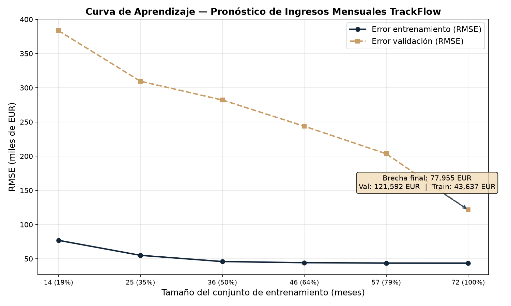

# Evaluación Técnica del Modelo de Pronóstico — TrackFlow

**Fecha:** 2026-10-02
**Modelo evaluado:** RandomForestRegressor (n_estimators=400, min_samples_leaf=4, max_features=0.6)
**Período de entrenamiento:** 2016-01 – 2023-12 (96 meses)
**Validación cruzada:** TimeSeriesSplit (5 folds)
**Validación para curva de aprendizaje:** 2022-01 – 2023-12 (24 meses fijos)

---

## 1. Validación Cruzada Temporal

Se aplicó `TimeSeriesSplit` con 5 folds **sin barajar** los datos. En cada fold,
las features de lag y medias rodantes se construyeron **desde cero** usando solo el
historial disponible antes de cada fila, garantizando que ningún fold
contamine al siguiente.

| Métrica | Media ± Desviación estándar (EUR) |
|---|---|
| MAE  | 78,737.09 ± 32,142.78 |
| RMSE | 105,854.07 ± 33,851.21 |

### Resultados por fold

| Fold | Train (inicio → fin) | Val (inicio → fin) | MAE (EUR) | RMSE (EUR) |
|---|---|---|---|---|
| 1 | 2016-01 → 2017-04 | 2017-05 → 2018-08 | 47,964.70 | 78,140.81 |
| 2 | 2016-01 → 2018-08 | 2018-09 → 2019-12 | 102,227.31 | 132,297.60 |
| 3 | 2016-01 → 2019-12 | 2020-01 → 2021-04 | 56,320.67 | 77,021.76 |
| 4 | 2016-01 → 2021-04 | 2021-05 → 2022-08 | 64,514.02 | 90,639.90 |
| 5 | 2016-01 → 2022-08 | 2022-09 → 2023-12 | 122,658.74 | 151,170.28 |

La desviación estándar del RMSE a través de los 5 folds es de
33,851.21 EUR, lo que representa un **32.0 %** de la media.
La variación entre folds es **alta variación entre estos folds**. Los folds cubren periodos diferentes; esta variabilidad no mide aisladamente la sensibilidad a pequeños cambios en la muestra.

## 2. Curva de Aprendizaje

La curva de aprendizaje se generó con un **conjunto de validación fijo** de 24 meses
(2022-01 – 2023-12) y tamaños crecientes del conjunto de entrenamiento
(desde 20 % hasta el 100 % de los 72 meses previos a 2022). Al crecer el conjunto,
también se acorta la distancia temporal hasta validación; la curva no aísla el
efecto del tamaño de muestra.

### Puntos clave de la curva

| Tamaño train | RMSE train (EUR) | RMSE val (EUR) | Brecha (EUR) |
|---|---|---|---|
| 14 meses | 76,968.65 | 383,445.99 | 306,477.34 |
| 25 meses | 55,040.82 | 309,520.28 | 254,479.46 |
| 36 meses | 45,948.28 | 282,074.42 | 236,126.15 |
| 46 meses | 44,253.13 | 243,784.39 | 199,531.26 |
| 57 meses | 43,703.65 | 203,501.53 | 159,797.89 |
| 72 meses | 43,636.56 | 121,591.82 | 77,955.26 |

### Interpretación del patrón

La brecha train-validación es amplia (77,955 EUR; 64.1 % del RMSE de validación), lo que es compatible con sobreajuste, pero no lo demuestra: los conjuntos corresponden a periodos distintos y en esta curva cambian a la vez el tamaño y la distancia temporal a validación.

---

## 3. Métricas: MAE vs RMSE — Justificación

Ambas métricas se calcularon sobre cada fold de la validación cruzada:

- **MAE** (Error Absoluto Medio): mide el error promedio en valor absoluto. Es robusto
  a outliers pero no diferencia si el error se concentra en meses clave (ej. diciembre).
- **RMSE** (Raíz del Error Cuadrático Medio): penaliza errores grandes al elevarlos al
  cuadrado antes de promediar.

**Métrica principal informada: RMSE**

*Justificación:* RMSE da más peso matemático a errores grandes. No se encontró
una función de coste o política de negocio que confirme que ese peso represente
el impacto económico de TrackFlow. MAE se incluye como medida complementaria;
la métrica de decisión debe acordarse con quien usará el pronóstico.

---

## 4. Diagnóstico

**Clasificación:** indicios compatibles con sobreajuste; conclusión no concluyente.

La brecha train-validación es amplia (77,955 EUR; 64.1 % del RMSE de validación), lo que es compatible con sobreajuste, pero no lo demuestra: los conjuntos corresponden a periodos distintos y en esta curva cambian a la vez el tamaño y la distancia temporal a validación.

### Evidencia que respalda el diagnóstico

| Fuente | Indicador | Valor |
|---|---|---|
| Validación cruzada | RMSE medio | 105,854.07 EUR |
| Validación cruzada | RMSE baseline (leaf=2, max_features=0.9) | 92,308.17 EUR |
| Validación cruzada | Variación inter-fold (CV del RMSE) | 32.0 % |
| Curva de aprendizaje | Brecha train-val final | 77,955.26 EUR |
| Curva de aprendizaje | Proporción de brecha | 64.1 % |
| Curva de aprendizaje | Error relativo (val/media real 2022–2023) | 10.6 % |
| Tendencia de la curva | Mejora del error de validación | 68.3 % |

---

## 5. Acción Correctiva

Se evaluó una configuración regularizada (`min_samples_leaf=4`, `max_features=0.6`, 400 árboles). Su RMSE medio en CV fue 105,854.07 EUR, frente a 92,308.17 EUR del baseline; el MAE fue 78,737.09 EUR frente a 77,476.44 EUR. Ambos promedios CV empeoran. En 2024-01–2025-12 el candidato obtuvo RMSE 144,522.27 EUR y MAE 96,508.81 EUR; baseline: RMSE 138,289.70 EUR y MAE 119,884.68 EUR. Esta comparación es exploratoria, no independiente. No se recomienda sustituir el baseline si RMSE es la métrica acordada. Reducir árboles no es una regularización fiable; el candidato queda evaluado, no promovido.

---

## 6. Notas Adicionales

- Todos los resultados son **reproducibles** usando `random_state=42`.
- La validación cruzada usa **predicción directa** (one-step), no recursiva,
    y en cada paso incorpora el valor real del mes anterior a la siguiente predicción.
- Las reglas diagnósticas (brecha de 25%/15% y error relativo de 18%) son
    heurísticas, no criterios estadísticos universales.
- El periodo de prueba 2024–2025 se consultó al comparar configuraciones; sus
    métricas son exploratorias y no constituyen una estimación independiente.
