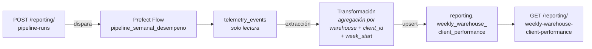

# Pipeline de Desempeño de Negocio — Diseño (v1)

> **TrackFlow** · Fase de diseño · Septiembre 2026

---

## 1. Estado Actual

**Qué hay hoy:** TrackFlow captura eventos de telemetría en la tabla `telemetry_events` (Supabase). Cuatro tipos de evento relevantes para inventario ya se están registrando:

| `event_type` | Qué captura |
|---|---|
| `inbound_order_created` | Recepción de mercancía en un almacén |
| `outbound_order_created` | Despacho de un pedido desde un almacén |
| `stock_threshold_triggered` | Un SKU cayó por debajo de su mínimo configurado |
| `inventory_discrepancy_detected` | Discrepancia entre stock sistema y stock físico |

**Reporte existente:** `services/telemetry/analysis.py` alimenta el endpoint `GET /telemetry/report`, que devuelve métricas técnicas para ingeniería (volumen de eventos por día, tasa de errores, latencia de API). **Este endpoint no se modifica.**

**La brecha:** Thomas (CEO) y Ana (Head of Warehouse Operations) necesitan un **consolidado semanal por almacén y por cliente** que mida cómo está funcionando el negocio: cuánta mercancía entra, cuántos pedidos se despachan, cuántas veces hay quiebres de stock, y que tan preciso es el inventario. Hoy esto lo arman los directores **a mano cada domingo por la noche**. No existe ningún pipeline que responda esta pregunta.

---

## 2. Propósito del Pipeline

Producir el **Reporte Semanal de Desempeño por Almacén y Cliente** que Thomas y Ana abren cada lunes, con cuatro KPIs operacionales calculados a partir de la telemetría de inventario:

| KPI | Qué mide | Campo calculado |
|---|---|---|
| **Volumen de entrada** | Unidades recibidas por almacén/cliente en la semana | `inbound_units_count` |
| **Throughput de salida** | Pedidos despachados por almacén/cliente en la semana | `outbound_orders_count` |
| **Frecuencia de quiebre de stock** | Veces que un SKU cayó bajo el mínimo | `stockout_events_count` |
| **Tasa de discrepancia** | Proporción de pedidos de salida con discrepancia de inventario | `discrepancy_rate` |

**Audiencia:** Thomas (CEO), Ana (Head of Warehouse Operations).
**Frecuencia:** semanal, fresco cada lunes por la mañana.

---

## 3. Flujo de Datos



### Extracción

- **Fuente:** `telemetry_events` (solo lectura, nunca se escribe).
- **Filtro:** los 4 `event_type` de la tabla de la sección 1, dentro del rango de la semana ISO a procesar.
- **Formato del payload:** cada evento tiene un envelope estándar (`eventId`, `timestamp`, `event_type`, `properties`). El campo `properties` contiene las claves específicas: `warehouse`, `client_id`, `quantity`, etc.
- **Cadencia:** semanal. Disparo automático (lunes) + manual vía endpoint.

### Transformación

Se agrupan los eventos por `(warehouse, client_id, week_start)` y se calculan los 5 campos de la tabla de destino:

| Campo | Fuente | Cálculo |
|---|---|---|
| `inbound_units_count` | `inbound_order_created` | suma de `properties.quantity` |
| `outbound_orders_count` | `outbound_order_created` | conteo de eventos |
| `stockout_events_count` | `stock_threshold_triggered` | conteo de eventos |
| `discrepancy_events_count` | `inventory_discrepancy_detected` | conteo de eventos |
| `discrepancy_rate` | calculado | `discrepancy_events_count / outbound_orders_count` (0 si no hubo salidas) |

### Carga

**Upsert** en `reporting.weekly_warehouse_client_performance` usando el constraint `UNIQUE (warehouse, client_id, week_start)`. Si la combinación ya existe, se sobreescriben todos los campos. Nunca se crea un duplicado.

**Manejo de actualizaciones:** cuando `telemetry_events` actualiza un registro existente (por ejemplo, se corrige un evento), el pipeline re-procesa la semana completa y el upsert sobreescribe la fila con los valores recalculados. La clave de deduplicación es la tupla `(warehouse, client_id, week_start)`.

---

## 4. Tabla de Destino

```sql
create table reporting.weekly_warehouse_client_performance (
  id uuid primary key default gen_random_uuid(),
  warehouse text not null,
  client_id text not null,
  week_start date not null,
  inbound_units_count integer not null default 0,
  outbound_orders_count integer not null default 0,
  stockout_events_count integer not null default 0,
  discrepancy_events_count integer not null default 0,
  discrepancy_rate numeric not null default 0,
  computed_at timestamptz not null default now(),
  unique (warehouse, client_id, week_start)
);
```

**Grano:** una fila por `warehouse` por `client_id` por semana ISO. Nunca se agrega entre clientes en la misma fila.

---

## 5. Resiliencia e Idempotencia

### Idempotencia

El pipeline puede ejecutarse múltiples veces sobre la misma semana sin producir duplicados ni corrupción:

1. **Extracción:** re-leer los mismos eventos produce el mismo DataFrame.
2. **Transformación:** los mismos eventos agrupados producen los mismos KPIs.
3. **Carga:** el `INSERT ... ON CONFLICT (warehouse, client_id, week_start) DO UPDATE` sobreescribe la fila existente con valores idénticos y actualiza `computed_at`.

**Segunda corrida después de un fallo en carga:** los registros que ya se insertaron correctamente se sobreescriben con los mismos valores (idempotentes). Los que no se insertaron se crean. Resultado final: la tabla refleja exactamente el estado correcto, sin duplicados.

### Log de Ejecución

Cada corrida registra en `reporting.pipeline_execution_log`:

| Campo | Tipo | Para qué sirve |
|---|---|---|
| `run_id` | `uuid` | Identificador único — permite correlacionar con errores y hacer seguimiento |
| `pipeline_name` | `text` | Identifica qué pipeline corrió (extensible a futuros pipelines) |
| `started_at` | `timestamptz` | Cuándo empezó — base para medir duración |
| `completed_at` | `timestamptz` | Cuándo terminó (NULL si falló) — calcula duración total |
| `status` | `text` | `running`, `completed` o `failed` — estado conocible en todo momento |
| `records_processed` | `integer` | Eventos leídos de `telemetry_events` — detecta corridas vacías |
| `records_written` | `integer` | Upsets realizados en destino — detecta fallos silenciosos de carga |
| `errors` | `jsonb` | Errores capturados con detalle — debugging sin revisar logs crudos |
| `week_start` | `date` | La semana procesada — queries de auditoría por período |

---

## 6. Mapeo a Prefect

### Flow principal: `pipeline_semanal_desempeno`

Orquesta el pipeline completo. Se dispara automáticamente cada lunes o manualmente vía `POST /reporting/pipeline-runs`.

| Task | Qué hace |
|---|---|
| `extraer_eventos_telemetria` | Lee `telemetry_events` filtrando por los 4 `event_type` y rango de semana ISO |
| `transformar_kpis_por_almacen_cliente` | Agrupa por `(warehouse, client_id, week_start)`, calcula los 5 campos |
| `cargar_en_reporting` | Upsert en `reporting.weekly_warehouse_client_performance` |
| `registrar_ejecucion` | Escribe en `reporting.pipeline_execution_log` con el resultado de la corrida |

### Flow secundario (opcional): `backfill_semanal_desempeno`

Variante parametrizable por rango de fechas para recomputar semanas históricas. Mismos tasks, diferente rango de entrada.

### Estados relevantes

- **Running:** durante la ejecución del flow.
- **Completed:** todas las etapas terminaron sin errores.
- **Failed:** al menos una task falló. El `errors` del log detalla qué falló y por qué.

### Prefect Blocks

- **Bloque de conexión a Supabase:** host, anon key, service role key. Centraliza credenciales, reutilizable por `services/reporting/` y por el flow.

---

## 7. Integración con la Aplicación

Tres endpoints nuevos en `services/reporting/`, separados de `services/telemetry/` y de `GET /telemetry/report`. **Ninguna lógica de ETL vive en `services/`** — solo se importa y delega a `data/pipelines/`.

### `GET /reporting/weekly-warehouse-client-performance`

Consulta la tabla de destino. Acepta `week_start` opcional (por defecto: última semana computada). Devuelve todas las combinaciones almacén/cliente de esa semana.

**Importa desde:** `data/pipelines/` → función `consultar_desempeno_semanal(week_start?)`

```json
{
  "week_start": "2026-09-08",
  "entries": [
    {
      "warehouse": "los_angeles",
      "client_id": "fashion-co",
      "inbound_units_count": 4200,
      "outbound_orders_count": 980,
      "stockout_events_count": 3,
      "discrepancy_events_count": 2,
      "discrepancy_rate": 0.002
    }
  ]
}
```

### `GET /reporting/pipeline-runs/latest`

Estado de la última corrida del pipeline. Reutilizable para cualquier pipeline futuro.

**Importa desde:** `data/pipelines/` → función `obtener_ultima_ejecucion()`

### `POST /reporting/pipeline-runs`

Dispara una corrida manual del pipeline. Acepta `week_start` opcional. Devuelve el `run_id` para seguimiento.

**Importa desde:** `data/pipelines/` → función `disparar_corrida_semanal(week_start?)`

---

## 8. Restricciones

- Cada fila pertenece a un único cliente — nunca se agrega entre clientes.
- `telemetry_events` es **solo lectura** — este pipeline nunca escribe ahí.
- `services/telemetry/analysis.py` y `GET /telemetry/report` quedan fuera del alcance — no se modifican.
- No se usan eventos fuera de los 4 listados en la sección 1.
