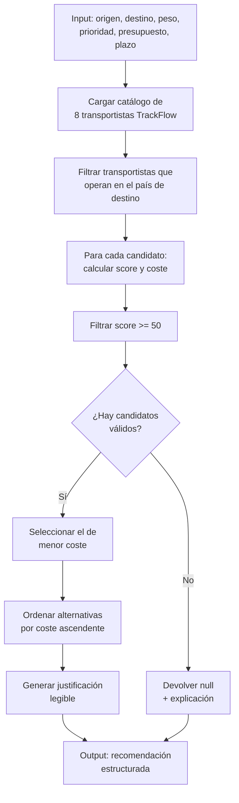

# Carrier Selection Optimizer — Skill

## Descripción

Esta skill automatiza la selección del mejor transportista para cada envío de TrackFlow, resolviendo el problema actual de Carlos Vega, que hoy coordina manualmente los 8 transportistas de la red (UPS, FedEx, MRW, SEUR, entre otros) sin herramientas de comparación estructurada.

La skill evalúa múltiples factores simultáneamente — coste, plazo de entrega, fiabilidad histórica, peso, fragilidad y cobertura geográfica — para recomendar el transportista más adecuado para cada envío.

---

## Inputs

| Campo | Tipo | Descripción | Ejemplo |
|---|---|---|---|
| `origin` | `WarehouseLocation` | Almacén de origen del envío | `"Los Angeles"` o `"Zaragoza"` |
| `destinationCity` | `string` | Ciudad de destino | `"Miami"` |
| `destinationCountry` | `Country` | País de destino | `"United States"` o `"Spain"` |
| `distanceKm` | `number` | Distancia desde el almacén al destino (km) | `3920` |
| `weightKg` | `number` | Peso total del envío (kg) | `4.5` |
| `isFragile` | `boolean` | Si el producto requiere manejo especial | `true` |
| `priority` | `ShipmentPriority` | Nivel de urgencia del envío | `"Express"` |
| `declaredValueUSD` | `number` | Valor declarado del contenido (USD) | `250.00` |
| `maxBudgetUSD` | `number` | Presupuesto máximo para el transporte | `45.00` |
| `requiredDeliveryDays` | `number` | Días máximos para la entrega | `3` |

## Outputs

La skill devuelve un objeto con la recomendación estructurada:

| Campo | Tipo | Descripción |
|---|---|---|
| `recommendedCarrier` | `Carrier` | El transportista seleccionado (datos completos: id, name, onTimeRate, etc.) |
| `score` | `number` | Puntuación de idoneidad (0–100) basada en el algoritmo `scoreCarrierForShipment` |
| `estimatedCostUSD` | `number` | Coste estimado calculado con `calculateShippingCost` |
| `estimatedDeliveryDays` | `number` | Días estimados (`carrier.avgDeliveryDays`) |
| `alternatives` | `Array<{carrier, score, cost}>` | Lista ordenada del resto de transportistas evaluados |
| `justification` | `string` | Explicación legible de por qué se seleccionó este transportista |

### Ejemplo de output

```json
{
  "recommendedCarrier": {
    "id": "CAR-UPS",
    "name": "UPS",
    "score": 87.5,
    "onTimeRate": 95
  },
  "estimatedCostUSD": 38.42,
  "estimatedDeliveryDays": 2,
  "alternatives": [...],
  "justification": "UPS opera en Estados Unidos, soporta prioridad Express, maneja productos frágiles y tiene la mejor tasa de entrega a tiempo (95%). Coste estimado: 38.42 USD (dentro del presupuesto de 45.00 USD)."
}
```

---

## Criterios de Aceptación

| # | Criterio | Verificación |
|---|---|---|
| CA1 | El transportista recomendado opera en el país de destino | `carrier.operatesIn.includes(destinationCountry)` → `true` |
| CA2 | El peso del envío no supera el máximo del transportista | `totalWeight <= carrier.maxWeightKg` → `true` |
| CA3 | El transportista soporta la prioridad solicitada | `carrier.acceptsPriority.includes(priority)` → `true` |
| CA4 | El coste estimado no supera el presupuesto máximo | `estimatedCostUSD <= maxBudgetUSD` → `true` |
| CA5 | Los días estimados de entrega no superan el máximo requerido | `estimatedDeliveryDays <= requiredDeliveryDays` → `true` |
| CA6 | Si el producto es frágil, el transportista lo maneja | `!isFragile \|\| carrier.handlesFragile` → `true` |
| CA7 | El score de idoneidad es ≥ 50 (umbral mínimo de adecuación) | `score >= 50` → `true` |
| CA8 | Si ningún transportista cumple todos los criterios, se devuelve `null` con un mensaje explicativo | Output indica "No se encontró transportista adecuado" |
| CA9 | Los alternativos se devuelven ordenados por coste ascendente | `alternatives[i].cost <= alternatives[i+1].cost` |
| CA10 | La justificación menciona al menos 3 factores que motivan la decisión | Revisión humana del texto |

---

## Lógica de negocio asociada

La skill utiliza las funciones ya implementadas en `src/utils/transformations.ts`:

- **`scoreCarrierForShipment(carrier, shipment, product)`** → Evalúa hasta 5 dimensiones (20 pts país, 20 pts peso, 15 pts prioridad, 15 pts fragilidad, 30 pts fiabilidad = 100 pts máx.)
- **`calculateShippingCost(shipment, product, carrier)`** → Coste base + peso × tarifa/kg + distancia × tarifa/km + recargo por prioridad (Express ×1.3, Same-day ×1.6)
- **`selectBestCarrier(carriers, shipment, product)`** → Filtra score ≥ 50 y selecciona el de menor coste
- **`sortCarriersByReliability(carriers, order)`** → Para ordenar por fiabilidad si hay empate

---

## Flujo de ejecución



---

## Uso

```typescript
import { selectBestCarrier, scoreCarrierForShipment, calculateShippingCost } from '@/utils/transformations';
import { carriers } from '@/data/carriers';

const result = selectBestCarrier(carriers, shipment, product);
if (result) {
  console.log(`Recomendado: ${result.carrier.name} — $${result.cost}`);
}
```

---

## Recursos adicionales

- [Catálogo de transportistas TrackFlow](./resources/carrier-catalog.md) — Los 8 transportistas con sus tarifas, cobertura y fiabilidad
- [Script de simulación](./scripts/optimize-carrier.py) — Script Python para probar la selección offline
- [Ejemplo de envío](./examples/shipment-example.json) — JSON con un caso real de selección