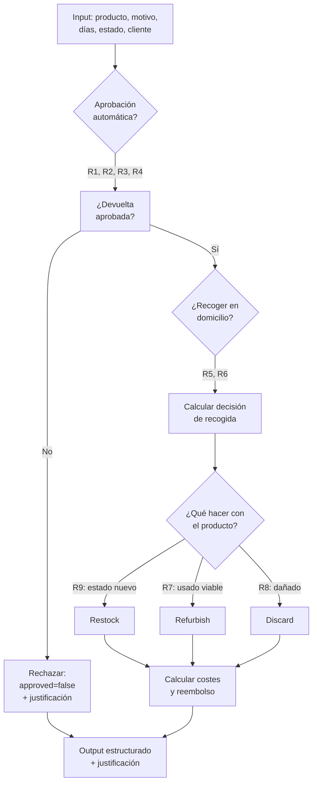

# Returns Triage Assistant — Skill

## Descripción

Esta skill automatiza la cadena de decisiones que Sofía Ramos y su equipo de 5 personas gestionan hoy manualmente para cada devolución de TrackFlow. Las devoluciones representan entre el 18% y el 25% del volumen total de la operación, y cada una requiere evaluar si aprobar o rechazar la devolución, si recoger el producto en domicilio o no, y si el producto devuelto debe reacondicionarse o desecharse.

La skill aplica reglas de negocio consistentes para todos los clientes y productos, reduciendo el tiempo de revisión humana y asegurando que las decisiones sean trazables y justificables.

---

## Inputs

| Campo | Tipo | Descripción | Ejemplo |
|---|---|---|---|
| `productSKU` | `string` | SKU del producto devuelto | `"SHOE-BLK-42"` |
| `productCategory` | `ProductCategory` | Categoría del producto | `"Fashion"` |
| `productUnitCostUSD` | `number` | Coste unitario del producto (para calcular valor residual) | `35.00` |
| `daysSincePurchase` | `number` | Días transcurridos desde la compra | `45` |
| `returnReason` | `ReturnReason` | Motivo de la devolución (ver tabla) | `"defective"` |
| `itemCondition` | `ReturnItemCondition` | Estado del producto devuelto | `"used"` |
| `customerType` | `CustomerType` | Tipo de cliente que devuelve | `"business"` |
| `originalShipmentWeightKg` | `number` | Peso del envío original | `2.5` |
| `originalShipmentCountry` | `Country` | País donde se entregó | `"Spain"` |
| `warehouseLocation` | `WarehouseLocation` | Almacén que recibe la devolución | `"Zaragoza"` |

### Tipos auxiliares

```typescript
type ReturnReason =
  | "wrong_item"       // Producto incorrecto recibido
  | "defective"        // Producto defectuoso o dañado
  | "not_as_described" // No coincide con la descripción
  | "changed_mind"     // Cambio de opinión del consumidor
  | "delivery_failed"  // No se pudo entregar
  | "excessive_return" // Cliente con historial de devoluciones elevado
  | "other";           // Otro motivo

type ReturnItemCondition =
  | "new"          // Sin abrir, en perfecto estado
  | "like_new"     // Abierto pero sin usar
  | "used"         // Usado pero funcional
  | "damaged"      // Dañado (no funcional o incompleto)

type CustomerType =
  | "business"     // Cliente marca (B2B)
  | "consumer";    // Consumidor final (B2C)
```

---

## Outputs

La skill devuelve una decisión estructurada con justificación:

| Campo | Tipo | Descripción |
|---|---|---|
| `approved` | `boolean` | ¿Se aprueba la devolución? |
| `pickUpRequired` | `boolean` | ¿Es necesario recoger el producto en domicilio? |
| `refurbishAction` | `"refurbish" \| "discard" \| "restock"` | Acción recomendada para el producto devuelto |
| `estimatedReturnCostUSD` | `number` | Coste estimado total de gestionar esta devolución |
| `refundPercentage` | `number` | Porcentaje del valor a reembolsar (0–100) |
| `justification` | `string` | Explicación de la decisión en lenguaje natural |
| `rulesApplied` | `string[]` | Lista de reglas de negocio que activaron la decisión |

### Ejemplo de output

```json
{
  "approved": true,
  "pickUpRequired": true,
  "refurbishAction": "restock",
  "estimatedReturnCostUSD": 8.50,
  "refundPercentage": 100,
  "justification": "Devolución aprobada. Producto defectuoso (Fashion, coste 35 USD) dentro del plazo de 60 días. Se recoge en domicilio porque supera el umbral de peso (>1 kg). El producto está en estado 'usado' pero su categoría (Fashion) es reacondicionable y su valor residual supera el coste de reacondicionamiento.",
  "rulesApplied": ["R1-auto-approve-defective", "R5-pickup-weight-threshold", "R7-refurbish-if-viable"]
}
```

---

## Criterios de Aceptación

| # | Criterio | Verificación |
|---|---|---|
| CA1 | Si el motivo es `defective` o `wrong_item` y han pasado ≤ 60 días, la devolución se aprueba automáticamente | `approved = true` |
| CA2 | Si `daysSincePurchase > 90` y el motivo no es `defective`, la devolución se rechaza | `approved = false` y justificación lo indica |
| CA3 | Si el cliente es `excessive_return` (más de 3 devoluciones en los últimos 6 meses), se rechaza | `approved = false` |
| CA4 | Si `itemCondition` es `new` o `like_new`, no se requiere recogida (`pickUpRequired = false`) a menos que `weight > 1 kg` | Lógica de umbral de peso |
| CA5 | Si `itemCondition` es `damaged` y no es `defective` como motivo, se rechaza | `approved = false` |
| CA6 | Si `itemCondition` es `new` o `like_new` y categoría no es perecedera, se recomienda `restock` | `refurbishAction = "restock"` |
| CA7 | Si `itemCondition` es `used` y el valor residual (`unitCost * 0.3`) ≥ coste de reacondicionamiento estimado, se recomienda `refurbish` | `refurbishAction = "refurbish"` |
| CA8 | Si `itemCondition` es `damaged` y coste de reparación estimado ≥ valor residual, se recomienda `discard` | `refurbishAction = "discard"` |
| CA9 | El `estimatedReturnCostUSD` se calcula como suma de logística inversa + reacondicionamiento (si aplica) | Coste ≥ 0 |
| CA10 | La justificación menciona explícitamente qué reglas se activaron | Contiene al menos una de `rulesApplied` |

---

## Reglas de negocio

### R1 — Aprobación automática por defecto/falta de coincidencia
```
SI motivo IN ("defective", "wrong_item")
  Y daysSincePurchase ≤ 60
→ approved = true, refundPercentage = 100
```

### R2 — Rechazo por antigüedad
```
SI daysSincePurchase > 90
  Y motivo ≠ "defective"
→ approved = false
```

### R3 — Rechazo por abuso de devoluciones
```
SI customerType = "consumer"
  Y historialDevoluciones (externo) > 3 en últimos 6 meses
→ approved = false
```

### R4 — Rechazo por daño no cubierto
```
SI itemCondition = "damaged"
  Y motivo ≠ "defective"
→ approved = false
```

### R5 — Recogida por peso
```
SI weightKg > 1
  Y approved = true
→ pickUpRequired = true
```

### R6 — Sin recogida si el producto está sin usar
```
SI itemCondition IN ("new", "like_new")
  Y weightKg ≤ 1
→ pickUpRequired = false
```

### R7 — Reacondicionamiento viable
```
SI itemCondition = "used"
  Y unitCostUSD * 0.3 ≥ returnCostRefurbish
→ refurbishAction = "refurbish"
```

### R8 — Desecho por daño severo
```
SI itemCondition = "damaged"
  Y repairCost ≥ unitCostUSD * 0.3
→ refurbishAction = "discard"
```

### R9 — Restock directo
```
SI itemCondition IN ("new", "like_new")
  Y category ≠ "Electronics" (por normativa)
→ refurbishAction = "restock"
```

---

## Flujo de ejecución



---

## Uso

```typescript
import { triageReturn } from '@/skills/returns-triage-assistant/scripts/triage-return';

const decision = triageReturn({
  productSKU: "SHOE-BLK-42",
  productCategory: "Fashion",
  productUnitCostUSD: 35.00,
  daysSincePurchase: 45,
  returnReason: "defective",
  itemCondition: "used",
  customerType: "consumer",
  originalShipmentWeightKg: 2.5,
  originalShipmentCountry: "Spain",
  warehouseLocation: "Zaragoza",
});

console.log(decision.justification);
```

---

## Recursos adicionales

- [Reglas de negocio detalladas](./resources/return-rules.md) — Árbol de decisiones completo con excepciones por categoría
- [Script de simulación](./scripts/triage-return.py) — Implementación Python del triage de devoluciones
- [Ejemplo de devolución](./examples/return-example.json) — JSON con un caso real de triage